# Sense.me - Open Source Framework for the Exploration and Visualization of Eye-tracking Data

- The complete code for all examples and for the final prototype is available here!
- The main prototype folder is: elasticviz/project
- Our work uses a standard Elasticsearch server and we have developed a new faceted web user interface for eye-tracking data analysis.
- Our work is based on previous work: https://github.com/WebUX-Group5/ui-demo-faceted
- The elasticsearch exploration project is located at the folder: elasticviz. The instructions on this page are for the project files contained in the elasticviz folder only! All the remaining folders, are not needed to run the elasticviz web app. We make them available in case you want to check other visualization examples, as a learning exercise.
- Running System: http://138.68.90.110/ 
- DOI: 

## What you will need: 
- Pull (or download) our project repository (this one)
- Download an install a standard Elasticsearch server (https://www.elastic.co/blog/elasticsearch-2-1-0-and-2-0-1-released)
- (if you want to make your elasticsearch server publicly available), we will also provide you with a python proxy (courtesy of our colleague Matthias Frey)
- Upload your eye-tracking data files to ElasticSearch (we will provide the means for that) and configure your datasets (using our Data Configurator)
- Run our web application (we will also provide the exact instructions and you just have to use Gulp)
- Enjoy: filter, explore and visualize your datasets

Thank you for checking our work!

# Project Screenshots:
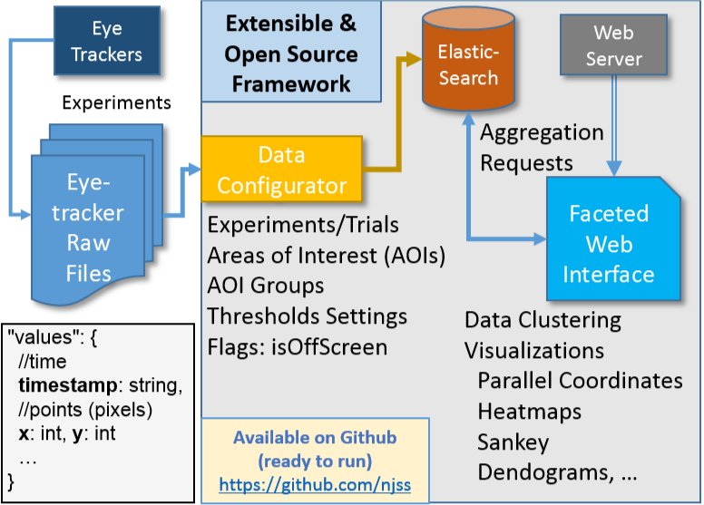
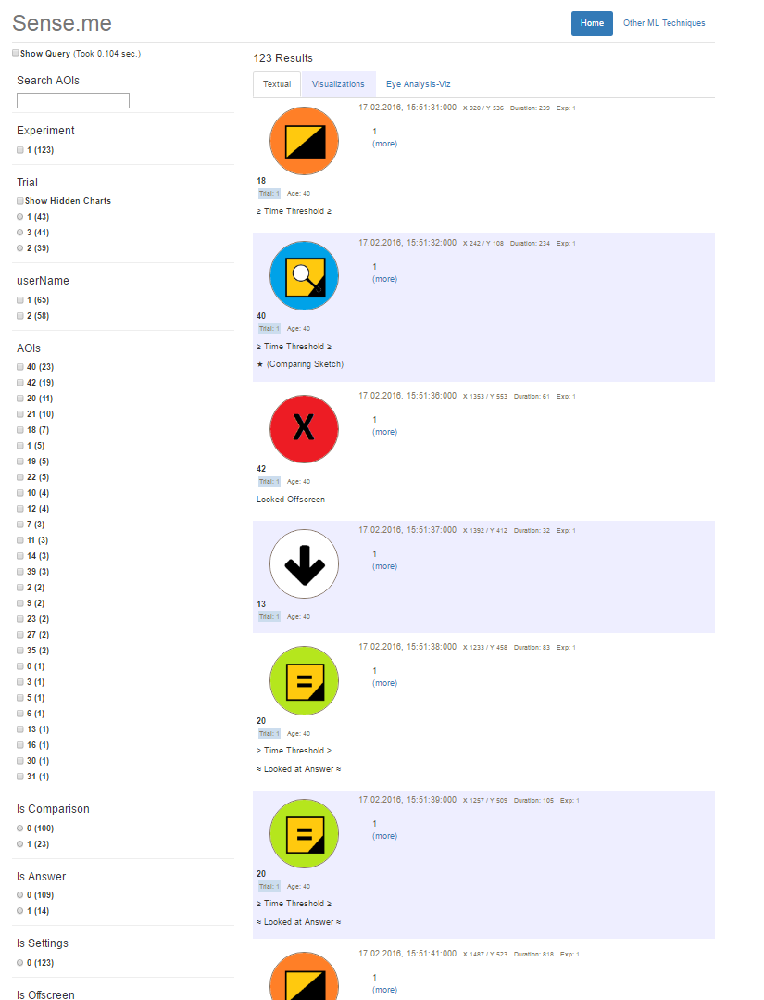
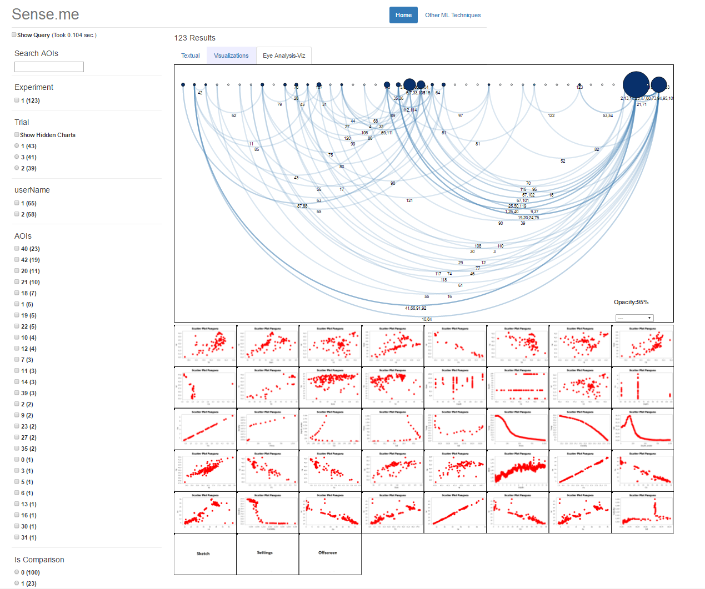
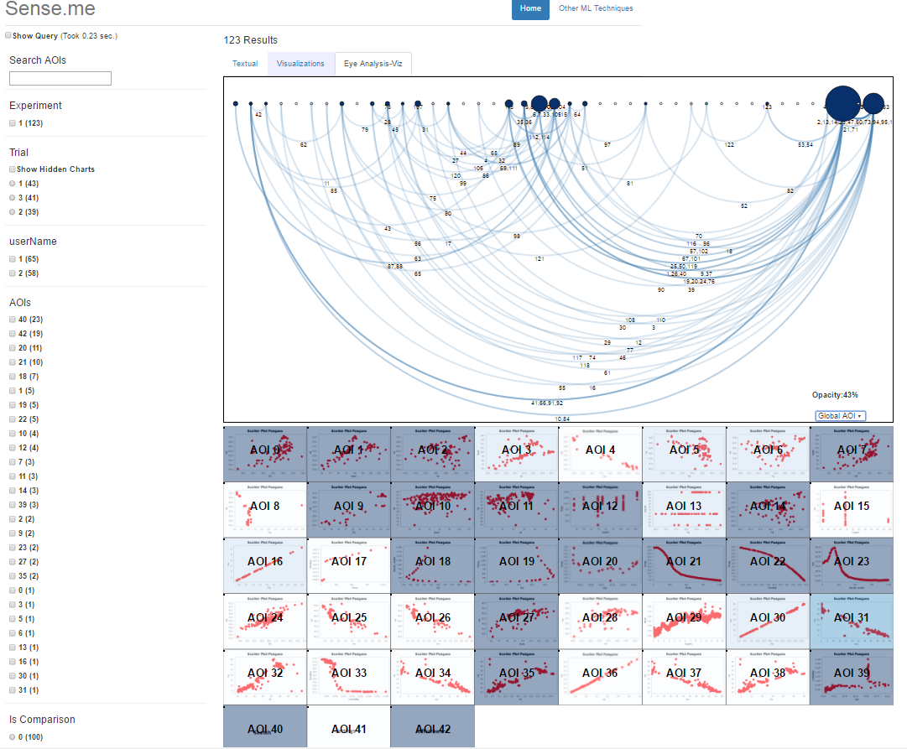
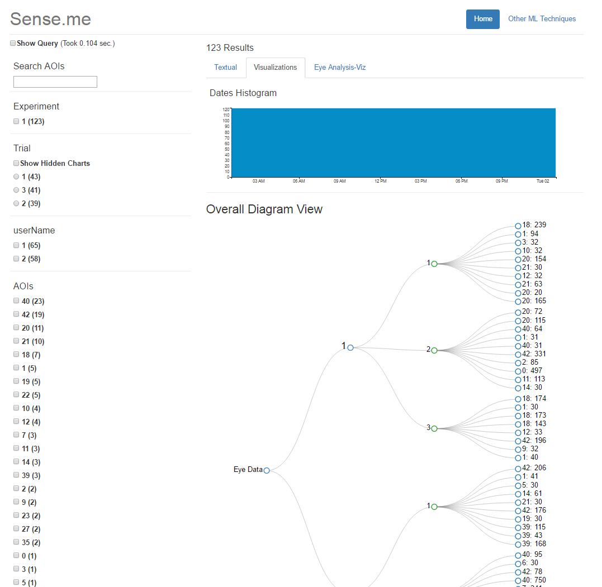
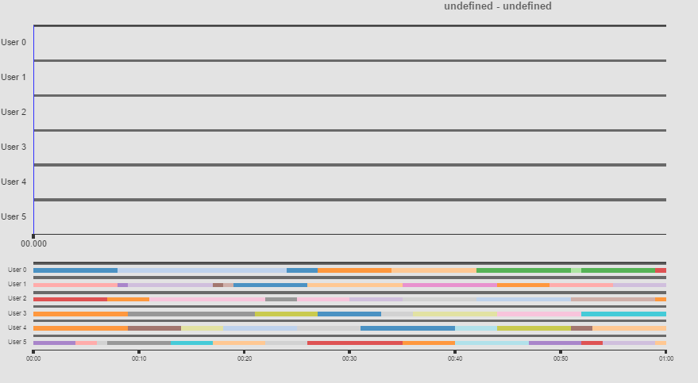
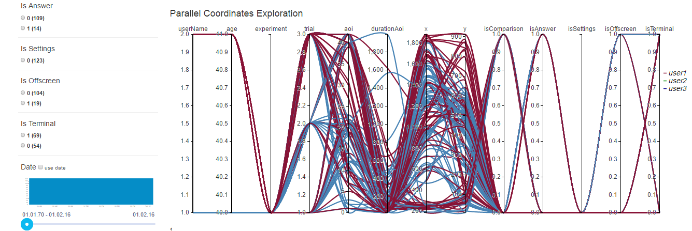
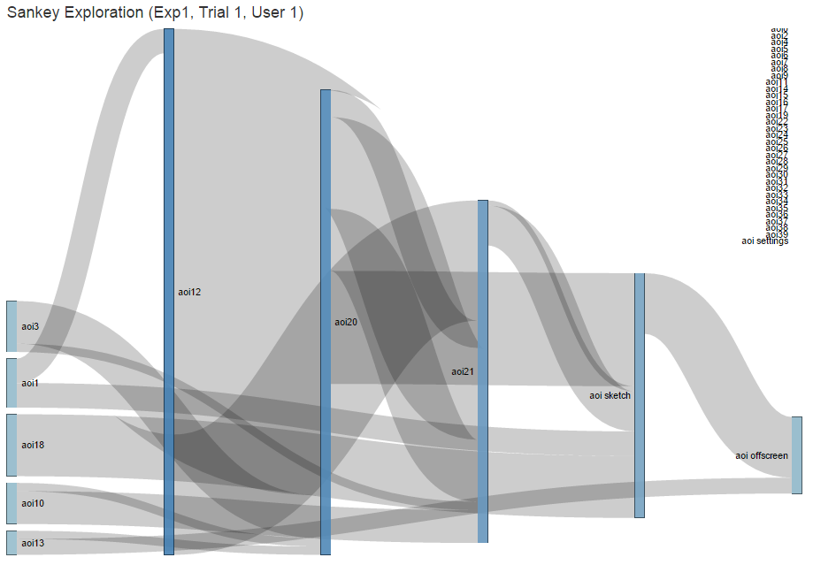
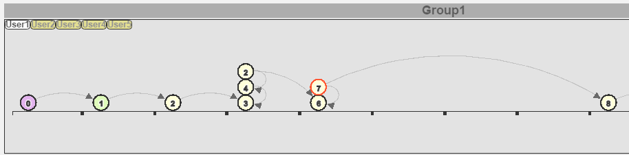
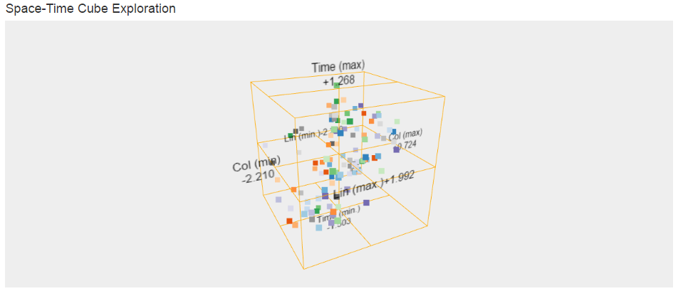
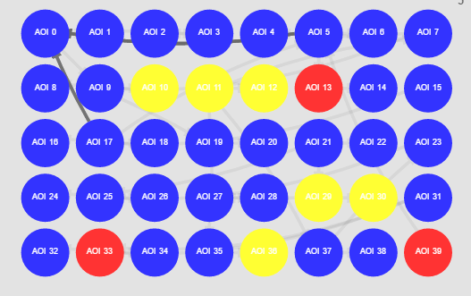
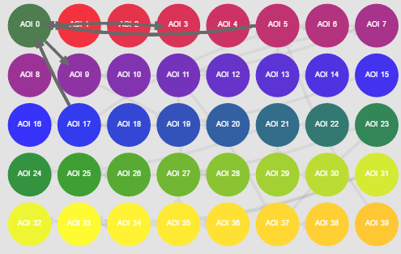

